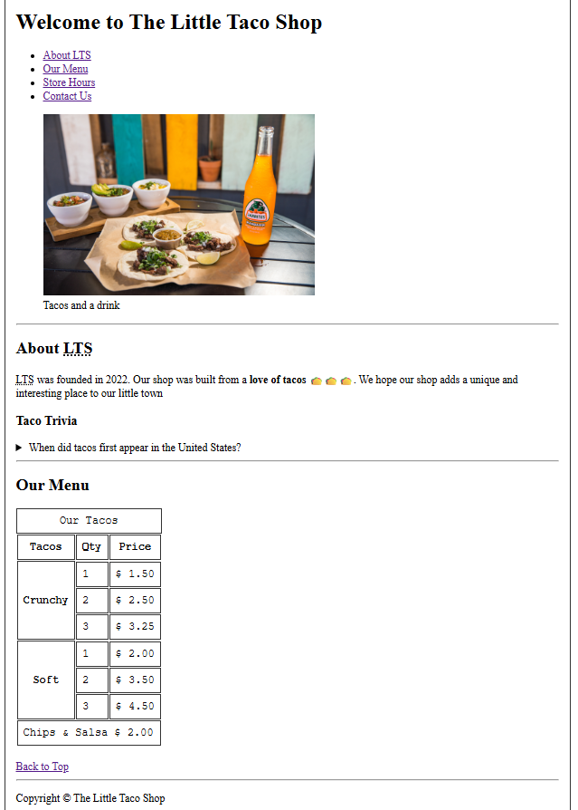
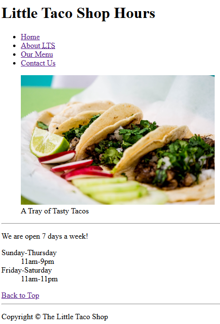
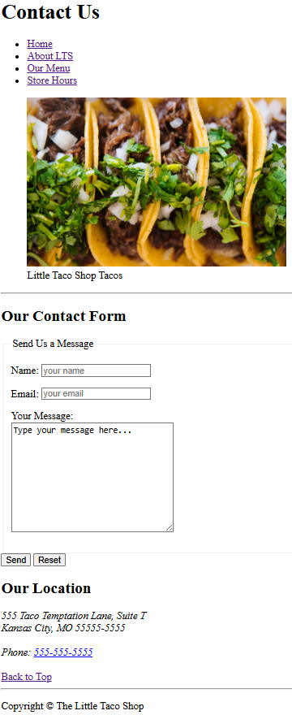

# Little Taco Shop

A simple HTML project created while learning web development through [freeCodeCamp](https://www.freecodecamp.org/learn) and Dave Gray's HTML course.

## Technologies

- HTML5

## Features

- Navigation menu

- About section

- Taco menu table

- Contact and Store Hours pages

## Screenshots

Index

Hours

Contact

